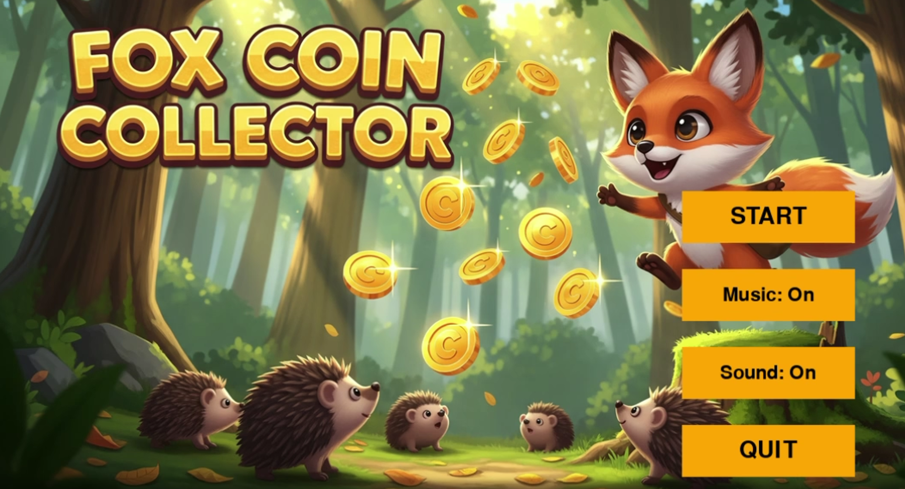
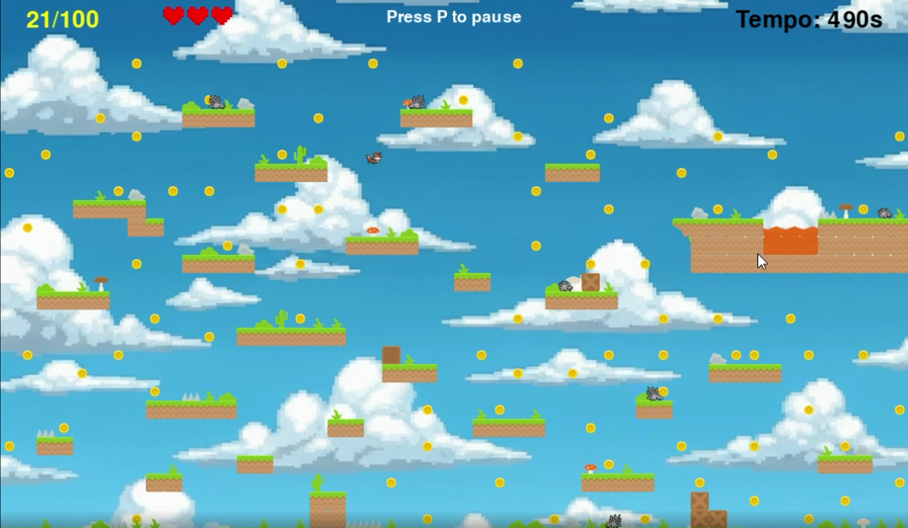

# 🦊 Fox Coin Collector

# 📱 Demo
<p align="center">
	
    
    
</p>

Uma experiência de **jogo 2D simples e divertida** feita em **Python com pyzero**, onde o jogador controla uma raposa para coletar moedas enquanto supera obstáculos.

Este projeto faz parte da minha exploração em desenvolvimento de jogos com Python 🐍 e frameworks leves para jogos 2D, com foco em lógica de jogo, colisões, animações e eventos de player.

---

## 🎮 Sobre o Jogo

**Fox Coin Collector** é um jogo estilo plataforma no qual o jogador:

- 💰 Coleta moedas espalhadas pelo mapa
- 🦊 Controla uma raposa com teclas de movimento
- ⚠️ Evita obstáculos e inimigos
- 🎶 Tem trilha sonora e efeitos
- 📊 Placar que aumenta conforme coleta moedas

O jogo foi construído com base nos arquivos de nível, sprites e lógica distribuídos pela biblioteca `pyzero`.

---

## 🧠 Tecnologias e Arquivos

- **Python** – Linguagem principal
- **pyzero** – Framework de desenvolvimento de jogos
- Assets:
  - `images/` – sprites e gráficos
  - `sounds/` – música e efeitos
  - `kenney_platformer-art-pixel-redux/` – gráficos de plataforma

Arquivos principais:
📦 fox_coin_collector
 ```
┣ 📂 images
┣ 📂 sounds
┣ 📂 kenney_platformer-art-pixel-redux
┣ ┣ …
┣ game.py
┣ player.py
┣ enemy.py
┣ collisions.py
┣ menu.py
┗ platformer.py
 ```
